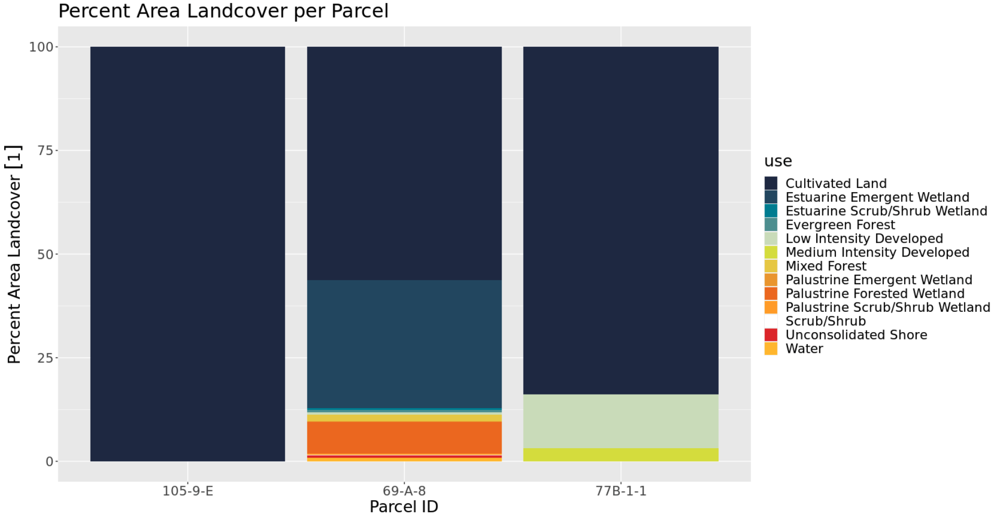
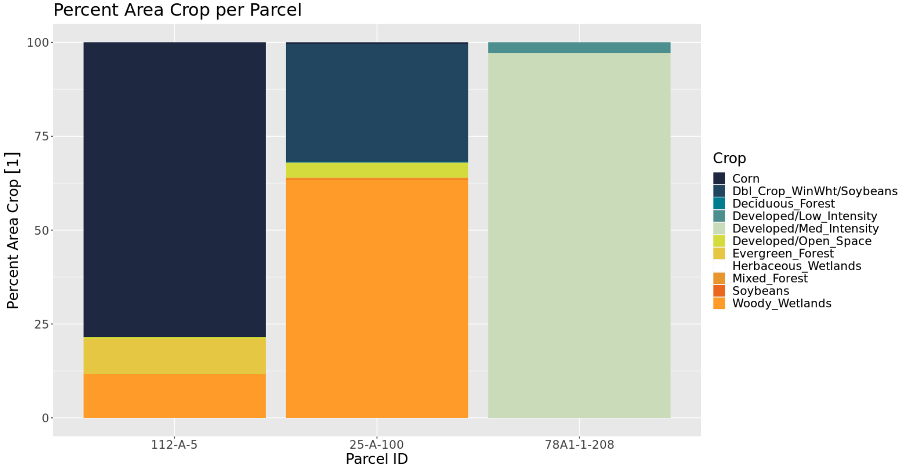
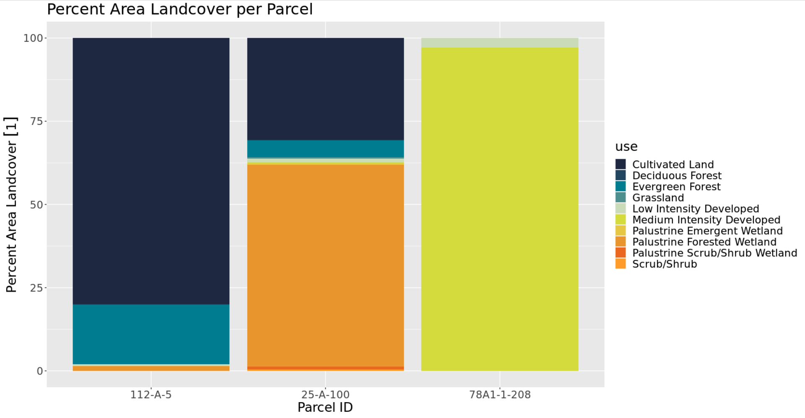

In order to visualize how the data was manipulated, three parcels from each county were selected and their percent area land uses were graphed. The graphs shown below include Northampton and Accomack Counties for the year 2016 from both Cropland Data Layer with the CCAP Regional Land Cover and Change. It is interesting to compare and contrast the two data sources to see any similarities or differences among the same exact areas. The type of activity that is going on in these parcels, indicates the purpose of the land whether that is agricultural, industrial, communal, or uninhabited. These graphs also test the confidence of our data transformation. The totaling percentages from all these land uses for each parcel is equal to 100%. This is a good indication because both original data sets had no overlap in their geometries; therefore, no percent area crop or land cover should exceed 100%. These graphs confirm that.

####*Northampton Cropland Data Layer Parcel Use*

####*Northampton CCAP Landcover Parcel Use*  

As you can see in the CDL data, parcel 105-9-E has two major crops: corn and soybeans. This is a continuing theme among the whole county. More specifically, the CDL data indicates that the entire parcel is used for agricultural purposes. The CCAP data supports this. Even though the CCAP data is more general and has several different measures, the graph for parcel 105-9-E shows that 100% of the land is used for 'Cultivated Land'. This is a strong indication that both data sources are accurate. In the CCAP data, it is easy to see how predominate agricultural land is on the Eastern Shore. In each parcel, above 50% of the land is used for 'Cultivated Land'. Specifically, in the CDL data, parcel 77B-1-1, uses about 65% of its land for corn and soy crops, but roughly 35% of that parcel is used for 'developed/open space'. In the CCAP data, about 82% of the land in parcel 77B-1-1 is covered in 'cultivated land' and the rest of the area is used for 'low and medium intensity developed' land. While these percentages are not exact, they are following along the same lines and include the same land use purposes. In the middle of both graphs, the land of parcel 69-A-8 has a variety of uses, spanning from crops and wetlands to developments. 

####*Accomack Cropland Data Layer Parcel Use*

####*Accomack CCAP Landcover Parcel Use*

Above are the CDL and CCAP data graphs for Accomack County and its three sample parcels. Just as seen in the Northampton graphs, corn and soybean seems to be the predominate crop used. In the CDL data, 'woody wetlands' appears to be the predominate use of land in parcel 25-A-100. In the CCAP data for parcel 25-A-100, 'palustrine forested wetlands' took up roughly 60% of the land area. This is another similarity that indicates the reliability of these two data sources. More than half parcel 25-A-100 land contains forested wetlands indicating that there is very little use and development of that land. While parcel 78A1-1-208 is used strictly for low and medium intensity development. This parcel is most likely where people live. The left side of the graph shows parcel 112-A-5. In this parcel, both data sources show that there is a large amount of land being used for agricultural, specifically corn. The rest of the land in parcel 112-A-5 seemed to be  made up of forest and wetlands.

In final, the graphs from the CDL data have many similarities and roughly follows the same distribution and many similar attributes as the CCAP data graphs. Comparing these four graphs give the total output from the data transformation added confidence. They also model an idea of the entire land use on Virginia's Eastern Shore. 

####*Next Steps*
After the data transformation, the CDL and CCAP data will be used to inform projections of the synthetic population. By identifying parcels with high agricultural use and high crop production, the team will be able to locate specific households within those parcels and label them as a farm or not a farm. These households will be a focus for the continuation of the project as they are at high risk from the repercussions of climate change. 

