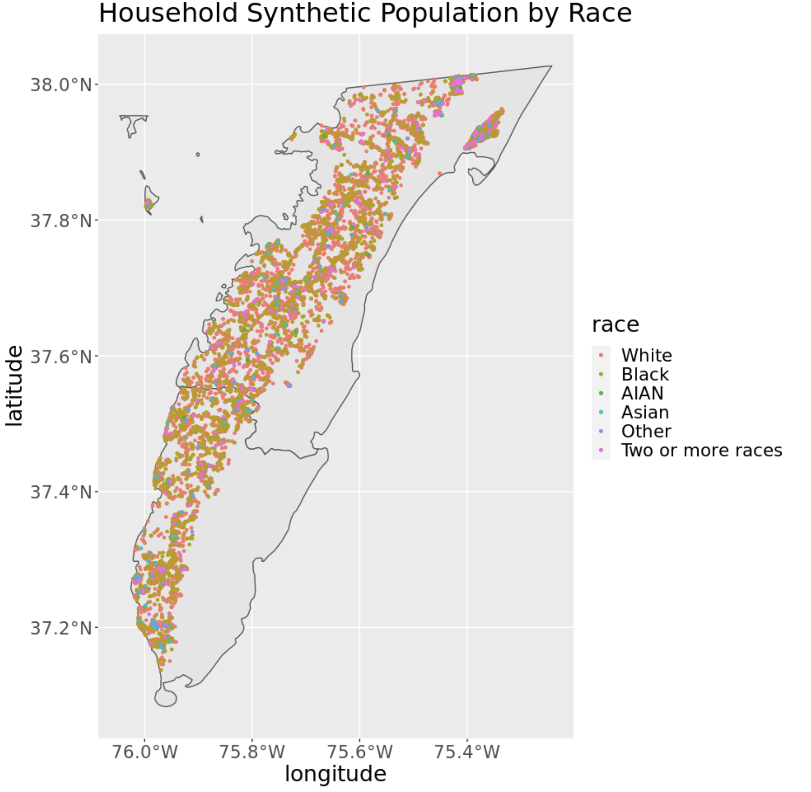
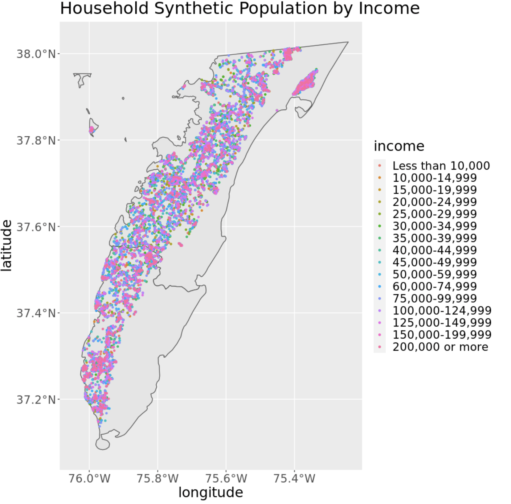
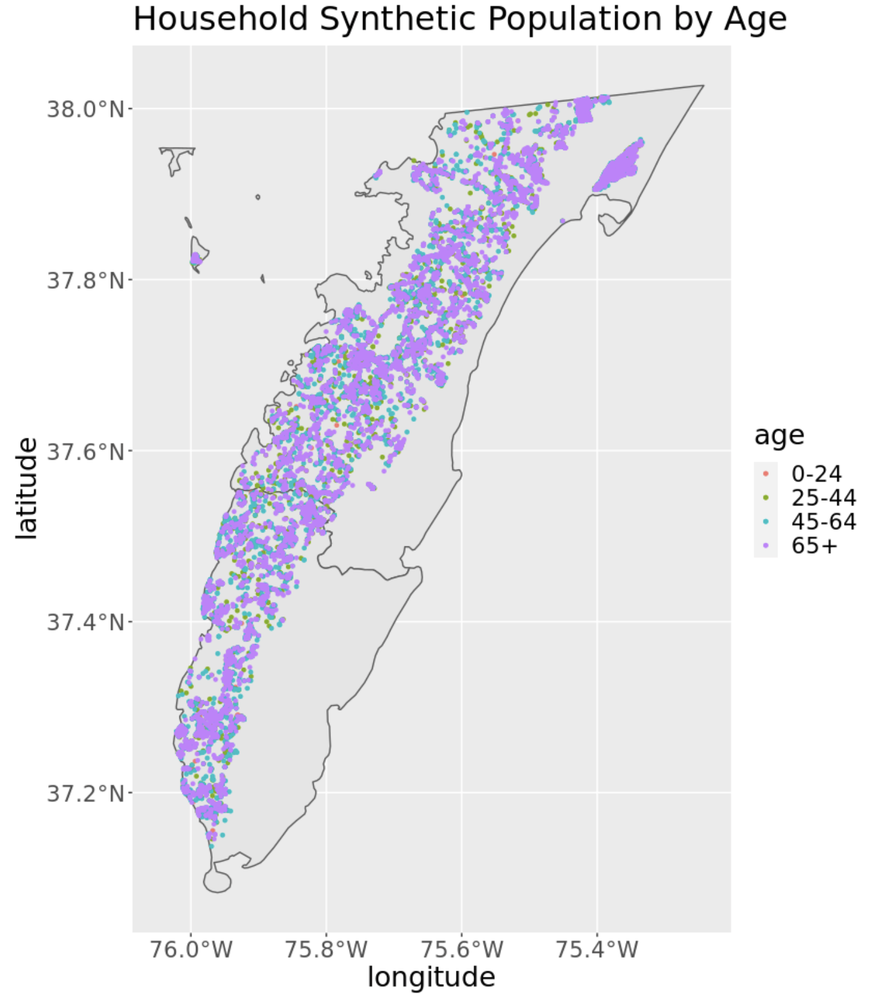

To examine the synthetic population more in depth and highlight the vulnerable population most effected by climate change in Northampton and Accomack county, lets look into some initial exploratory data analysis of the synthetic population of 17,401 people. 

##Race

  

{width=60%}

  

Above is a plot of the race distribution of the household synthetic population geographically. As well as a bar graph showing the distribution of race by tenure in the population. AIAN is abbreviated for American Indians and Alaska Native. Based on the IPF output, the population consists of mostly white and black people evenly dispersed throughout the Eastern Shore; However, looking more closely at the bar graph, the vast majority of the population is white. People who are white are more likely to own their home and people who are black tend to be more likely to rent their home. 

##Income

  

{width=60%}

This plot shows the income level distribution of the household synthetic population geographically. This plot appears to have more clustering in specific regions compared to the synthetic population by race plot. 

  

The bar graph above shows the synthetic household by income level and race. It is clear to see that the white population tends to make more than the rest of the population. The higher income level leads to a more of a probability that the synthetic person is white. While a lower income level leave to more of a probability that the synthetic person in black. The most frequent income level is '$75,000 - $99,999'. The distribution is skewed to a lower income-level rather. 

  

This bar graph shows the income-level distribution by age, rather than race. Ages 0-24 have lower income than other age categories. This is expected as this age range includes children and young adults. Ages 65+ make up a large variety of income levels. the lower income levels for this age range could be due to retirement or loss of job. The higher income level could be caused by a older person working past retirement or wealthy people moving to the Eastern Shore for retirement. The most frequent income level, '$75,000 - $99,999', is dominated by people 45-64. This is also an expected result as this age range has more work experience and not yet retired. 

##Age

  

{width=60%}

  

Above is a plot of the age distribution of the household synthetic population geographically. As well as a bar graph showing the distribution of age by race in the population. The older population is much larger than the younger population. This indicates the population may be declining in the area, but no conclusions can be drawn unless looking at the population overtime. The major race present is white. This is expected as they make up the majority of the population. The black population is largely distributed in the 45-64 age range, while the white population is largely made up of ages 65 and up. The age distribution by race is a helpful way to see the demographics of the labor workers in this rural community. 

####*Next Steps*
The next step in the synthetic population is to attach household not at random, but based off the income level of the individual and property value of the household from the Black Knight data. This will give a more accurate representation of the real population. From here, the goal would be to preform demographic projections through a co-hort component method to create future population. These future population will be used in the agent-based models to see the possible effects of climate change on the Eastern Shore. 

