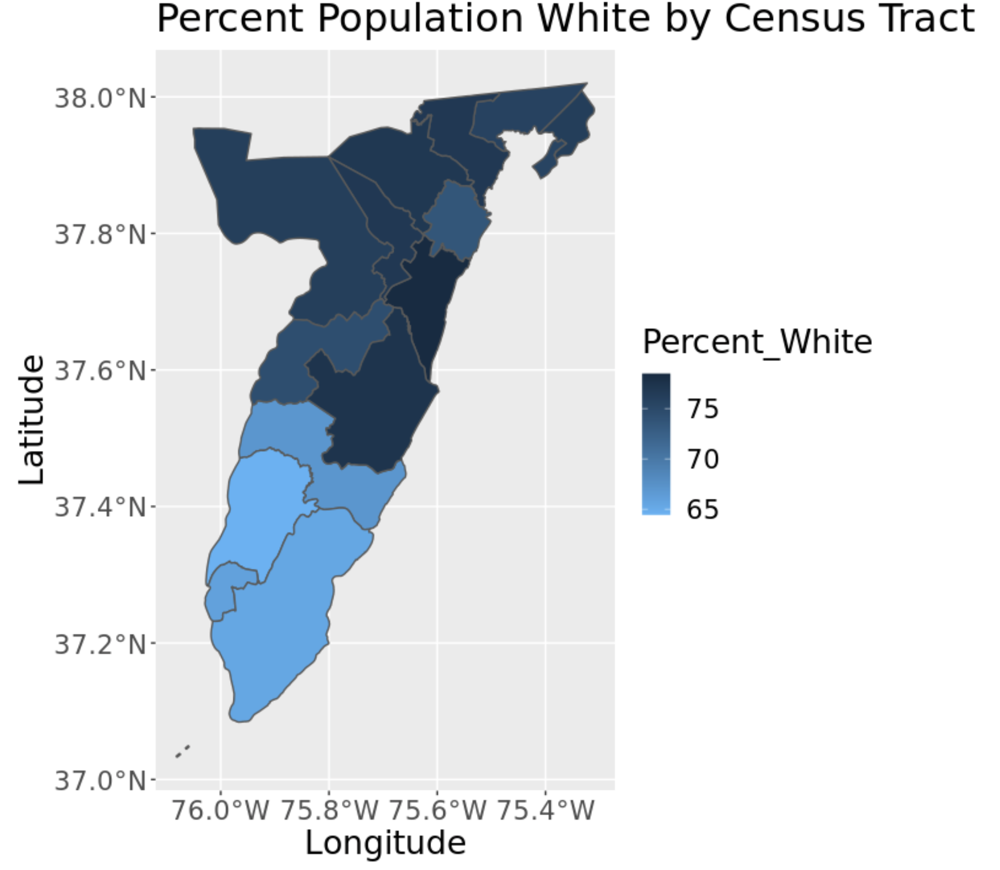

To examine the synthetic population more in depth and highlight the population most vulnerable to climate risks on the Eastern Shore most, lets look into some initial exploratory data analysis on the synthetic population of 17,401 householders. 

##Race

  

  

  

----------------------------------------------------------------

  

{width=40%} {width=40%}  

Above is a plot for the percent of each race aggregated from the household synthetic population to the census tract. As well as a bar graph showing the distribution of race by tenure in the population. AIAN is abbreviated for American Indian and Alaska Native. The population consists of mostly white and black people throughout the Eastern Shore with the vast majority of the population being white. It is important to note that the synthetic population is based acs data about 'householders'. This is going to have a definite effect on the demographics of the population. The darker the color, the higher percentage of that race in that census tract. The lighter the color, the lower percentage of that race in that census tract. There is clear split in the plots for the percentage population white vs black in each census tract. This is not unexpected as the majority of the population is made up of those two races. Accomack County has a higher white population percentage than Northampton County. In contrast, Northampton has a higher black population percentage. Northampton is also a smaller county than Accomack. The bar graph shows that people who are white are more likely to own their home and people who are black tend to be more likely to rent their home. 

##Income

  

{width=60%}

This plot shows the income level distribution of the household synthetic population geographically. This plot appears to have some clustering in specific areas. The darker the color means the more income that household makes. The lighter the color means the less income that household makes. 

  

The bar graph above shows the synthetic household by income level and race. It is clear to see that the white population tends to make more than the rest of the population. The higher income level leads to a more of a probability that the synthetic person is white. While a lower income level leave to more of a probability that the synthetic person in black. The distribution is skewed towards a lower income-level.

  

This bar graph shows the income-level distribution by age, rather than race. Ages 0-24 have lower income than other age categories. This is expected as this age range includes children and young adults. Ages 65+ make up a large variety of income levels. The lower income levels for this age range could be due to retirement or loss of job. The higher income level could be caused by a older person working past retirement or due to personal wealth before or after retirement. The most frequent income level, '$75,000 - $99,999', is dominated by people 45-64. This is also an expected result as this age range has more work experience and not yet retired. The plot below examines the distribution of the most frequent income level of '$75,000 - $99,999' more closely. 

  
{width=50%}  

The plot above looks specifically at the $75,000 to $99,999 income level. This is the synthetic population's most frequent income level in all of Accomack and Northampton County. The darker color indicates a higher percentage of people in that census tract make $75,000 to $99,999. The lighter color indicates a lower percentage of people in that census tract make $75,000 to $99,999. 

##Age

  

Above is a bar graph showing the distribution of age by race in the population. The older population is much larger than the younger population. This is not unexpected as the data consist of householders. It is more probable that a person 65 or older is a householder, rather than a person in the age range 0 to 24 years old. The graph shows, the major race present is white. This is expected as the white ethnicity makes up the majority of the population. The black population is largely distributed in the 45-64 age range, while the white population is largely made up of ages 65 and up. 

  

{width=60%}

####*Next Steps*
The next step in the synthetic population is to attach household not at random, but based off the income level of the individual and property value of the household from the housing data. This will give a more accurate representation of the real population. From here, the goal would be to preform demographic projections through a co-hort component method to create future populations. These future population will be used in the agent-based models to see the possible effects of climate change on the Eastern Shore. 

