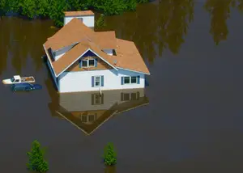
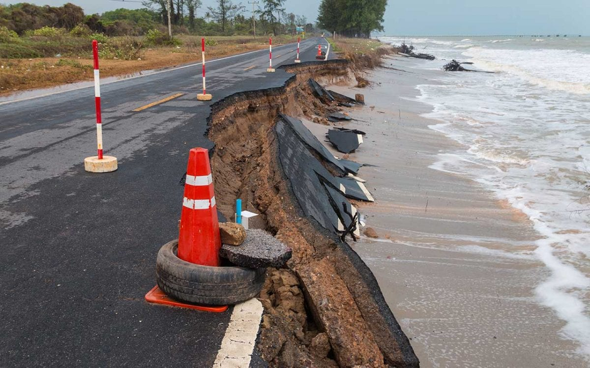

To Kick off the project, We started making surveys on various Scholarly sources under Climates Risks and Synthetic methods. The literature review helped us to gain familiarity with various methods involved in the process. We came to know about various theories driving the field and it  helped us to curate our approach.

  

{width=30%}

###**Categories**

The literature which we took into consideration for review can be classified into **two** categories.They are

- Climate Risks

- Synthetic Methods

###**Climate Risks**
Literature under Climate risks generally contains information about negative impacts of climate change. It explains how change in climate affects lives, livelihoods, health status, economic, social and cultural assets, etc. Rural coastal communities face difficult challenges responding to climate risks, particularly by **saltwater intrustion** from accelerated sea level rise and storm flooding. Saltwater intrusion is the leading edge of climate change on the coast. Accelerated sea-level rise and storm flooding is already impacting the world’s coastlines, most starkly evident as the abandonment of farms and the encroachment of saltwater wetlands creating “ghost forests” (Williams et al. 1999; Anderson &  Al-Thani  2016;  Kirwan  &  Gedan  2019).  These  changes  have  widespread  and  adverse  effects  on  the  largely  rural  communities,  economies,  and  well-being  primarily  by  reducing  agricultural  production,  degrading water quality, and impacting infrastructure (Kahn et al. 2016; Tully et al. 2019). The extent to which saltwater will affect agricultural and natural ecosystems, and the livelihoods that depend on them, is also dependent on decisions by individual landowners and industry (e.g., agriculture, poultry) about water management  (Poulter  et  al.  2008;  Bhattachan  et  al.  2018),  and  by  conservation  organizations  to  protect  shorelines  (Shepard  et  al.  2011;  Sutton-Grier  et  al.  2015).  In  many  rural  regions,  climate  impacts  have  disproportionate effects on underserved community members, particularly those of color (Hardy et al. 2017; Jurjonas & Seekamp 2020)

  

{width=30%}  

  

{width=30%}  

**Literatures:**

- Evaluating the economic cost of coastal flooding

- Future of our coasts

- Racial coastal formation 

- Sea level driven land conversion and the formation of ghost forests

- The Invisible Flood

- Sea Level Rise and Coastal Forest Retreat on the West Coast of Florida, USA

###**Synthetic Methods**

The main goal of our project is to construct a synthetic population for Accomack and Northampton counties using Iterative proportional Fitting. Although environmental data are widely available at the household and parcel level, social information at this spatial resolution poses privacy issues to residents despite the obvious advantages it lends to policymakers and researchers. We will use an innovative technique  to synthesize multiple sources of socio-economic data, including surveys and publicly available administrative records (e.g.,  American  Community  Survey,  tax  assessments,  and  others  documented  in  the  Data  Management  Plan), to construct community profiles at the parcel or household level. The use of synthetic populations is an approach that can retain aggregate population characteristics at larger community levelsSynthetic methods generally includes literature related to construction of Synthetic Population. Data collected on different spatial scales can be combined, and the derived statistical relationships allow us to aggregate over local spatial scales that can be tailored to the question (e.g., elevation) and are 
8 relevant to policy making, rather than relying solely on Census designated tracts or county-level data. Given the heterogeneity of households and communities in the ESVA, we will segment the synthetic populations into socio-demographic subgroups linked spatially, and by information-flows, livelihood, and governance. Potential  differences  in  risk  perception,  available  information  and  resources,  exposure,  impact,  and  environmental  decision  making,  will  be  statistically  estimated,  and  spatially  represented  by  synthetic  population groups in the coupled socio-environmental mode Methods for generating synthetic data include Iterative Proportional Fitting (IPF) and Multiple imputation(MI).

**Literatures:**

- Creating Synthetic Baseline Population

- mice: Multivariate Imputation by Chained Equations in R

- Inference for Partially Synthetic, Public Use Microdata Sets

