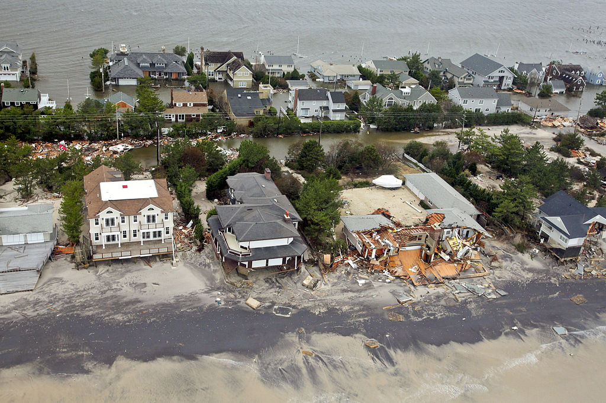

##**Literature Review**
To Kick off the project, We started making surveys on various Scholarly sources under Climates Risks and Synthetic methods. The literature review helped us to gain familiarity with various methods involved in the process. We came to know about various theories driving the field and it  helped us to curate our approach.

{width=40%}

###**Categories**

The literatures which we took into consideration for review can be classified into **two** categories.They are

- Climate Risks

- Synthetic Methods

###**Climate Risks**
Literatures under Climate risks generally contains information about negative impacts of climate change. It explains how change in climate affects lives, livelihoods, health status, economic, social and cultural assets, etc. 
 
**Literatures:**

- Evaluating the economic cost of coastal flooding

- Future of our coasts

- Racial coastal formation 

- Sea level driven land conversion and the formation of ghost forests

- The Invisible Flood

- Sea Level Rise and Coastal Forest Retreat on the West Coast of Florida, USA

###**Synthetic Methods**

Synthetic methods generally includes literatures realted to construction of Synthetic Population. Methods for generating synthetic data include Iterative Proportional Fitting (IPF) and Multiple imputation(MI).

**Literatures:**

- Creating Synthetic Baseline Population

- mice: Multivariate Imputation by Chained Equations in R

- Inference for Partially Synthetic, Public Use Microdata Sets

