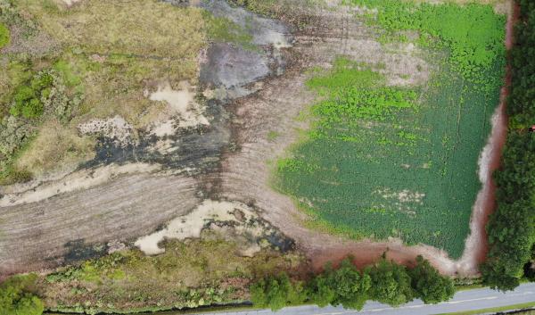
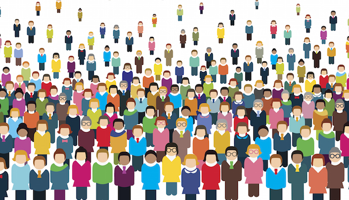

We began with a review of the literature to get a better understanding of climate risks faced by rural coastal communities to learn a quantitative approach for characterizing these communities. The literature review helped us to gain familiarity with methods and it helped us to curate our approach in constructing a synthetic population.

The literature which we took into consideration for review can be classified into **two** categories.

- Climate Risks

- Synthetic Methods

  

{width=40%}

###**Climate Risks**
Literature about climate risks for coastal communities  is focused on how change in climate affects lives, livelihoods, health status, economic, social and cultural assets, etc. Rural coastal communities face difficult challenges responding to climate risks, particularly by **saltwater intrustion** from accelerated sea level rise and storm flooding. Saltwater intrusion is the leading edge of climate change on the coast. Accelerated sea-level rise and storm flooding is already impacting the world’s coastlines, most starkly evident as the abandonment of farms and the encroachment of saltwater wetlands creating “ghost forests” (Williams et al. 1999; Anderson &  Al-Thani  2016;  Kirwan  &  Gedan  2019).  These  changes  have  widespread  and  adverse  effects  on  the  largely  rural  communities,  economies,  and  well-being  primarily  by  reducing  agricultural  production,  degrading water quality, and impacting infrastructure (Kahn et al. 2016; Tully et al. 2019). The extent to which saltwater will affect agricultural and natural ecosystems, and the livelihoods that depend on them, is also dependent on decisions by individual landowners and industry (e.g., agriculture, poultry) about water management  (Poulter  et  al.  2008;  Bhattachan  et  al.  2018),  and  by  conservation  organizations  to  protect  shorelines  (Shepard  et  al.  2011;  Sutton-Grier  et  al.  2015).  In  many  rural  regions,  climate  impacts  have  disproportionate effects on undeserved community members, particularly those of color (Hardy et al. 2017; Jurjonas & Seekamp 2020)

{width=29%}  {width=33%}  {width=35%}

**Journal Articles Reviewed:**

- Evaluating the Economic Cost of Coastal Flooding (Desmet 2018)

- Future of Our Coasts: The Potential for Natural and Hybrid Infrastructure to Enhance the Resilience of Our Coastal Communities, Economies, and Ecosystems (Grier 2015)

- Racial Coastal Formation: The Environmental Injustice of Colorblind Adaptation Planning for Sea-Level Rise (Hardy 2017) 

- Sea Level Driven Land Conversion and the Formation of Ghost Forests (Kirwan and Gedan 2019)

- The Invisible Flood: The Chemistry, Ecology, and Social Implications of Coastal Saltwater Intrusion (Tully 2019)

- Sea Level Rise and Coastal Forest Retreat on the West Coast of Florida, USA (Williams 1999)

###**Synthetic Methods**

The main goal of our project is to create detailed profiles of at-risk commnities by constructing a synthetic population for Accomack and Northampton counties. Although environmental data are widely available at the fine-scale geographical resolution, social information at the household and parcel level poses privacy issues to residents despite the obvious advantages it lends to policymakers and researchers. We will use an innovative technique to synthesize multiple sources of socio-economic data, including surveys and publicly available administrative records (e.g.,  American  Community  Survey,  tax  assessments,  and  others  documented  in  the  Data  Management  Plan), to construct community profiles at the parcel or household level. The use of synthetic populations is an approach that can retain aggregate population characteristics at larger community levels. Synthetic methods generally have many sources of literature related to the construction of Synthetic Populations to develop a deeper understanding. Data collected on different spatial scales can be combined, and the derived statistical relationships allow us to aggregate over local spatial scales that can be tailored to the question (e.g., elevation) and are 8 relevant to policy making, rather than relying solely on Census designated tracts or county-level data. Given the heterogeneity of households and communities in the ESVA, we will segment the synthetic populations into socio-demographic subgroups linked spatially, and by information-flows, livelihood, and governance. Potential  differences  in  risk  perception,  available  information  and  resources,  exposure,  impact,  and  environmental  decision  making,  will  be  statistically  estimated,  and  spatially  represented  by  synthetic  population groups in the coupled socio-environmental mode. Methods for generating synthetic data include Iterative Proportional Fitting (IPF) and Multiple imputation(MI).

  

{width=40%}

**Journal Articles Reviewed:**

- Creating Synthetic Baseline Population (Beckman 1996)

- MICE: Multivariate Imputation by Chained Equations in R (Buuren 2011)

- Inference for Partially Synthetic, Public Use Microdata Sets (Reiter 2003)

