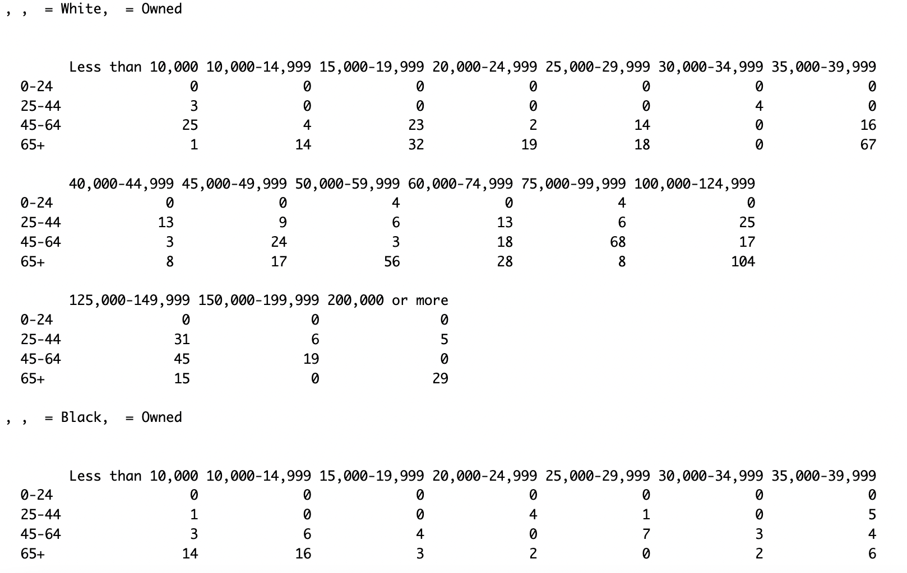

The  goal of our project is to impute a synthetic population that represent those Accomack and Northampton communities  by combining information from various sources of data, administrative and survey data to get a representation of those rural communities down to the level of individual households and farms. That will be used as an input into agent based models for stakeholder decisions, and hydrological models to measure flood hazard, water supply, and groundwater salinization.  The use of synthetic populations is an approach that can retain aggregate population characteristics at larger community levels (e.g., Census block, neighborhood, farming sector) while constructing “synthetic” households using imputation methods without  compromising  privacy.


##**Methodology**
The Method used for the construction of Synthetic Population is **Iterative Proportional Fitting** because IPF is computationally efficient  and it involves resampling from microdata and can include housing data for more precise sub-block group estimation.

IPF estimates a joint table given marginal constraints

The **Procedure** is :

1. Adjust cells using marginal column totals; divide by (cell column sums/ marginal column totals)

2. Adjust cells using marginal row totals; divide by (cell row sums/ marginal row totals)

3. Iterate (1) and (2) until convergence

###**Resampling and adding locations**

- IPF produces a maximum entropy estimate of the joint table subject to constraints of the marginals

  + Our IPF output was a list with categories like Race, Income level, Age, Tenure and number of households
  
  + To be precise it was around 896 variables
  
####**IPF OUTPUT**
</center>

The above picture is a screenshot from the result of Iterative Proportional Fitting output. This picture is a small portion from  IPF output performed on **one** census tract. When we take a look at it, we can see that there are four variables. They are Race, Tenure, Age and Salary.


Basically it shows the number of householders for different conditions of variables. 

- For example, if we see the second row of the first column, the value is **3**. 

- It indicates us that there 3 householders who are **White** with salary **less than 10,000**, **betwwen age 25 - 44** and **owning** a home.

The actual output contains values for various conditions of those variables. 

They are

- Races : White, Black, AIAN, Asian, NHPI and Other

- Tenure : Owned, Rented

- Age: 0-24, 25-44, 45 -64, 65+

- Salary : Less than 10,000, 10,000-14999 .....200,000 or more

We have created a dataframe form the IPF output (One Census tract) and linking it below. You can see that there is a Freq column which indicates the number of householders. 

```{r, layout="l-body-outset", echo = FALSE}
library(rmarkdown)
paged_table(readRDS("/home/jme6bk/github/CoastalFutures/Data_and_Codes/freq_IPF_output.RDS"))
```


- There is a **Resampling process** involved with microdata which is just simple **random sample** with replacement  

-  We sampled SERIALNO from the ACS PUMS data tables (see data - ACS) that matches each cell from the ipf output to create synthetic population  

- Final step involves attaching Latitiudes  and Longitudes For that process, We took the blackknight housing data, extracted the latitiude and longitude coordinates  and linked those coordinates with our sampled output.

###**Northampton and Accomack Synthetic Population**
We have created a function to automate the  IPF process to perform IPF on all census tracts of Accomack and Northampton counties. The Synthetic population dataframe  for Northampton and Accomack counties which is generated after linking Serialno and Coordinates are linked below.

####*Northampton Synthetic Population*
```{r, layout="l-body-outset", echo = FALSE, results = 'asis'}
library(rmarkdown)
paged_table(readRDS("/home/jme6bk/github/CoastalFutures/Data_and_Codes/NorthamptonsampledfSF_Coords.RDS"))

```
####*Accomack Synthetic Population*
```{r, layout="l-body-outset", echo = FALSE, results = 'asis'}
library(rmarkdown)
paged_table(readRDS("/home/jme6bk/github/CoastalFutures/Data_and_Codes/AccomacksampledfSF_Coords.RDS"))

```


###**Methods to improve Sophistication**

- There are three methods to increase Sophistication

     + Choose a lat/long sampled uniformly over the Block Group
     
     + Sample from actual housing units
     
     + Match people to housing units  
     
     + Link IPF output and households based on income, taxes, and property value
  

###**Estimating Variability**

- To account for the error in the IPF procedure, we can repeat the steps over multiple runs for sample-based error estimates.

- To account for the sampling variability, resample the marginal tables for each run.

###**R Implementatiom**
In order to implement IPF procedure in R, there is a package called **mipfp**


