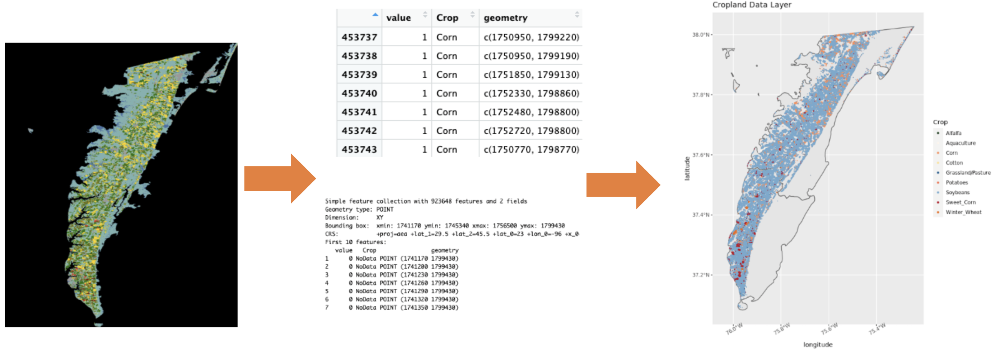
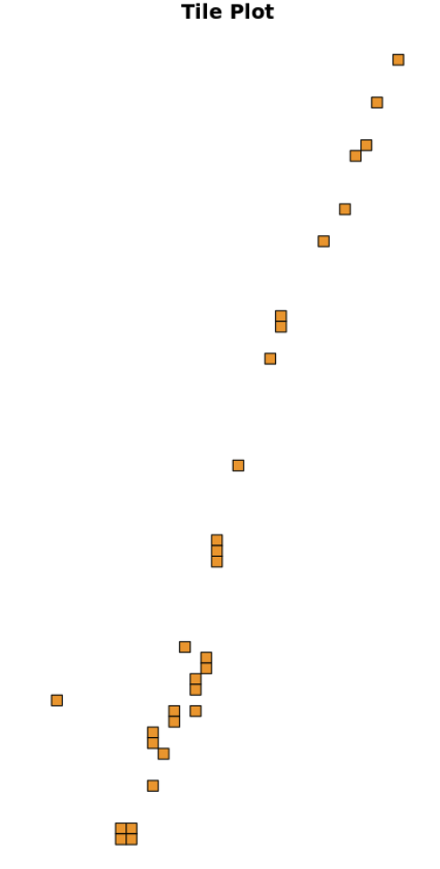

##**Cropland Data Layer**
The purpose of the Cropland Data Layer is to use satellite imagery to provide acreage estimates to the Agricultural Statistics Board for major commodities and to produce digital, crop-specific, categorized geo-referenced output products. The spatial resolution is 30 meters covering the Continental United States. However, the data was filter to just Northampton and Accomack County for this project. The years of available data for these two counties were 2021 to 2008 and 2002. The original CDL data can be found [here](https://croplandcros.scinet.usda.gov). 

The goal of this data transformation was to find the area of each crop in specific parcels. As an example, the data transformation processes for Corn in Northampton is listed below. 

###*1. Import through 'CropScapeR' Package*
The CDL data is available in raster-based GeoTIFF (.TIF) file format or can be obtain as a simple features object through an R Package called 'CropScapeR'. The data was imported through 'CropScapeR' because the tile coordinates were necessary to link this Cropland Data Layer to county parcel geometries. The .TIF file provided an image but no useful geometries. The coordinates of the CDL data are given in point geometry as the centroid of the raster cells. The plots below show the data's similar distribution from raster to sf object. 

<p align="center">  

  
</p> 


###*2. A 30 meter buffer was added to centroids*
From these centroids, a buffer was added to create the 30x30m resolution of the original data, creating polygon geometries. This was an essential step to be able to intersect the tiles with the counties' parcel geometries. Two checks were in place to ensure this buffer was preformed correctly. First, an area column was added to the data set to ensure each tile had an area of 900 square meters. Second, the first 30 tiles were simply plotted to ensure no overlap. (see below)

<p align="center">  

{width=30%}
</p>

###*3. Subset to Crop Tiles and Intersect with Parcel Geometeries*
From here, each tile of a specific crop type was subsetted and intersected with the ArcGIS parcel data for the two counties. Notice the repeat of parcel IDs. The next step will combine all corn tiles for one unique parcel into one geometry .

```{r, layout="l-body-outset", echo = FALSE, results = 'asis'}
library(rmarkdown)
paged_table(readRDS("/home/jme6bk/github/CoastalFutures/Data_and_Codes/corn_accomack2.RDS"))
```
####*4. Group Tiles by Parcel ID*
Grouped by a specific parcel ID, the geometries of each tile were joined within that parcel to create the coordinates of corn within that unique parcel. Notice how there are no longer repeat parcel IDs.

```{r, layout="l-body-outset", echo = FALSE, results = 'asis'}
library(rmarkdown)
paged_table(readRDS("/home/jme6bk/github/CoastalFutures/Data_and_Codes/merge_corn_accomack1.RDS"))

```

####*5. Attach Parcel Area and Create Percent Area Crop Column*
All that is left is to create a column of percent corn for each parcel. This is done by linking parcel area onto the data frame and doing simple math to create the column shown below. The area of the corn in a parcel was divided by the total area in the parcel and multiplied by 100.

```{r, layout="l-body-outset", echo = FALSE, results = 'asis'}
library(rmarkdown)
paged_table(readRDS("/home/jme6bk/github/CoastalFutures/Data_and_Codes/merge_corn_accomack2.RDS"))

```

####*6. Repetition*
This process is repeated for each crop for each year in both Accomack and Northampton County. A function was created to automate this process. Below is an example of one of data sets for Northampton crops for the year 2021. 

```{r, layout="l-body-outset", echo = FALSE}
library(rmarkdown)
paged_table(readRDS("/home/jme6bk/github/CoastalFutures/Data_and_Codes/Northampton2021.RDS"))
```

The code can be found [here](https://github.com/uva-bi-sdad/dspg22_coastal/tree/master/src/parcels) under the R scripts labeled CDL_Parcel_intersections, CDLfunction, and CDL_exploration. 

##**C-CAP Regional Land Cover and Change**
A similar process as the CDL was preformed on the CCAP data. However, the CCAP data was originally in polygon geometries, so there was no need to create a buffer. From here, the data transformation was identical to the CDL data. 

- 1: Subset to One Land use 

- 2: Run Intersection Between Parcels and CCAP Data  

- 3: Group By Parcel ID And Join All the Land use Within a Parcel to Create the Coordinates of Land use In One Parcel

- 4: Link Total Parcel Area to Data frame 

- 5: Create a Column With Total Area of Each Land use for One Parcel  

- 6: Repetition (Create a Function to Automate Process For Each Land use for Each Year)

Below is the output after the transformation for the CCAP data in 2016. 

```{r, layout="l-body-outset", echo = FALSE, results = 'asis'}
library(rmarkdown)
paged_table(readRDS("/home/jme6bk/github/CoastalFutures/Data_and_Codes/landuse2016.RDS"))

```

The code for this process can be found [here](https://github.com/uva-bi-sdad/dspg22_coastal/blob/master/src/parcels/CCAP_Parcel_intersections_and_function.R) under the R script labeled CCAP_Parcel_intersections_and_function.

