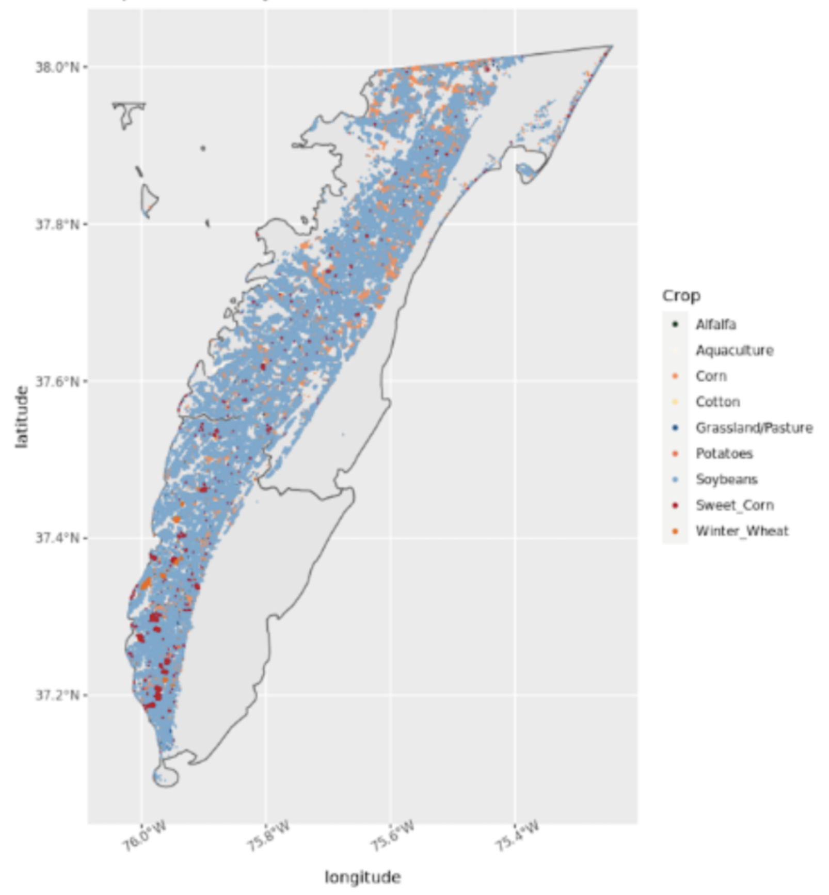

##**Cropland Data Layer**
The purpose of the Cropland Data Layer is to use satellite imagery to provide acreage estimates to the Agricultural Statistics Board for major commodities and to produce digital, crop-specific, categorized geo-referenced output products. The spatial resolution is 30 meters covering the Continental United States. However, the data was filter to just Northampton and Accomack County for this project. The years of available data for these two counties were 2002, and annually from 2008 and 2021. [1]

Below is the data set for Northampton County in 2021. See Data Transformation tab in Methods to find out how this data was manipulated to serve the project's purposes.


```{r, layout="l-body-outset", echo = FALSE}
library(rmarkdown)
paged_table(readRDS("/home/jme6bk/github/CoastalFutures/Data_and_Codes/Northampton2021.RDS"))
```
<p align="center">  

{width=50%}
</p>

##**C-CAP Regional Land Cover and Change**
The Land Cover and Change data documents the types of features that cover the surface of the Earth. This data quantifies how much of a region is covered by forest, wetlands, impervious surfaces, and agriculture- as well as these feature's locations. This data is available every 5 years for Northampton and Accomack County. These years include 1996, 2001, 2006, 2010, 2016. CCAP data is available as a simple feature object. This data was manipulated similarly to the CDL data to get the percent area of land cover in each parcel. Below is a example of the CCAP data for 2016 after manipulation and a plot of 8 different types of land cover in the Eastern Shore of Virginia.  See Data Transformation tab in Methods to find out how this data was manipulated to serve the project's purposes.

```{r, layout="l-body-outset", echo = FALSE}
library(rmarkdown)
paged_table(readRDS("/home/jme6bk/github/CoastalFutures/Data_and_Codes/landuse2016.RDS"))
```

<p align="center">  

{width=60% }  
</p>


##**Parcels Data**
There is public data on Virginia parcels to represent property boundaries across the Eastern Shore of Virginia.
The counties of Northampton and Accomack are divided up into parcels. In Northampton county, there are 16,123 total parcels and in Accomack county there are 48,435 parcels. These parcels are a consistent sub-county unit of measure that will be utilized throughout the course of this project. The table below is a snapshot of the parcel data as a simple features object. These boundaries are associated with the Regional land Cover and Change, Cropland Data Layer, and housing data. 

```{r, layout="l-body-outset", echo = FALSE}
library(rmarkdown)
paged_table(readRDS("/home/jme6bk/github/CoastalFutures/Data_and_Codes/ESVAparcels.RDS"))

```

These two plots show the parcels boundaries within the two separate counties.

<p align="center">  

  
</p>

##**Housing Data**
The Data & Analytics division of Black Knight manages the nation's leading repository of loan-level residential mortgage data and performance information. They have housing information for the Eastern Shore that includes tax data, housing characteristics, and locations. This data is used to represent the housing stock when building the synthetic population. 

##**American Community Survey**

####*ACS Public Use Microdata Sample*
From the ACS Public Use Microdata Survey, 3,851 households were surveyed from the Middle Peninsula, Northern Neck & Accomack-Northampton Planning District Commissions PUMA. Information is combined from this microdata on age, race, household income, and tenure along with ACS summary tables at the census tract level that is used to create the synthetic population. This cleaned data set is randomly sampled with replacement through the iterative proportional fitting technique to create the synthetic population and placed into households. The data frame below shows the categories as well as the frequency of times each appear. 

```{r, layout="l-body-outset", echo = FALSE}
library(rmarkdown)
paged_table(readRDS("/home/jme6bk/github/CoastalFutures/Data_and_Codes/microdata.RDS"))

```

####*ACS Tables*
These tables are 5-year estimates from 2016-2020 and are at the census tract level. IPF out-put is calculated for each census to create synthetic households. 
  
- B19037A-G: Age of Householder by Household Income by Race  

- B25007: Tenure by Age of Householder  

- B25003A-G: Tenure by Race  

-----------------------------------------------------------------------
1. [Original CDL Data](https://croplandcros.scinet.usda.gov)
