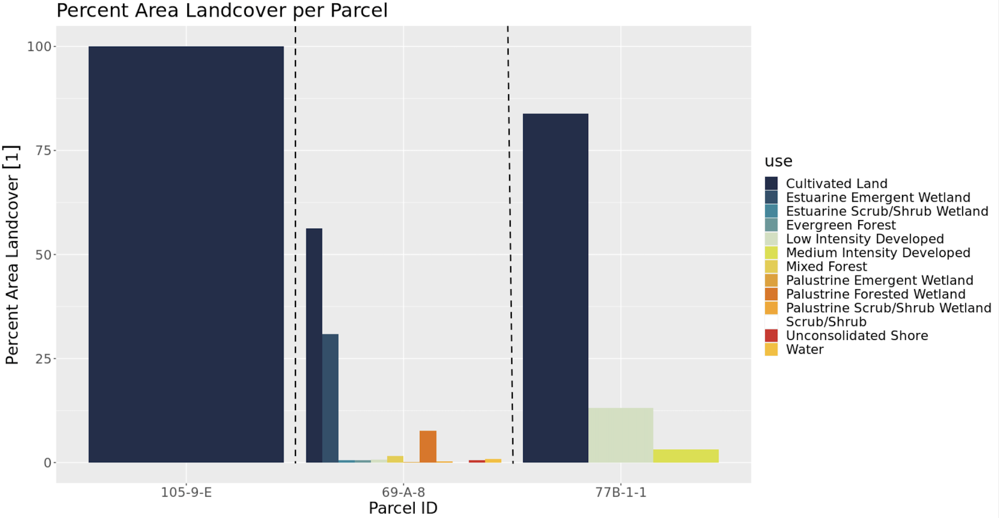
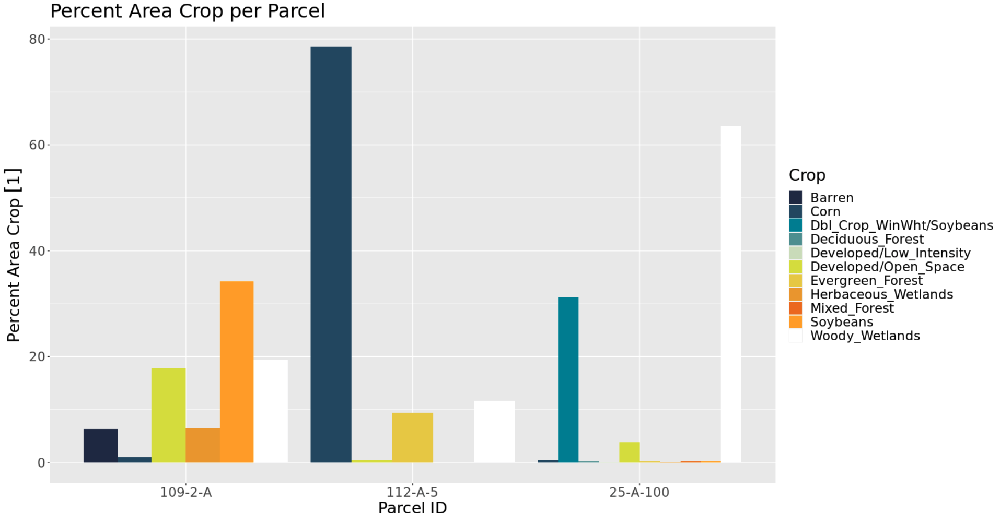
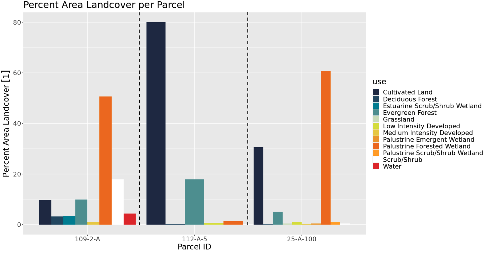

##**Cropland Data Layer & CCAP Regional Land Cover and Change**
To visually see how the data was manipulated, three parcels from each county were selcted. The graphs shown below include Northampton and Accomack Counties for the year 2016 from both Cropland Data Layer with the CCAP Regional Land Cover and Change. It is intresting to compare and contrast the two data sources to see any similarities or differences among the same exact areas. The type of activity that is going on in these parcels, indicates the purpose of the land wehether that is argicultural, industrial, communial, or uninhabitated.

####*Northampton Cropland data Layer Parcels*

####*Northampton CCAP Landcover Parcels*  

As you can see in the CDL data, parcel 105-9-E has two major crops: corn and soybeans. This is a continuing theme among the whole county. More specfifically, the CDL data indicated that entire parcel is used for argicultural purposes. The CCAP data supports this. Even though the CCAP data is more general and has several different measures, the graph for parcel 105-9-E is 100% used for 'Cultivated Land'. This is a strong indication that both data sources are accurate. In the CCAP data, it is easy to see how predominate argicultural land in on the Eastern Shore. In each parcel, above 50% of the land is used for 'Cultivated Land'. In the CDL data, parcel 77B-1-1, uses about 65% of its land for corn and soy crops, but roughly 35% of that parcel is used for 'developed/ open space'. In the CCAP data, about 82% of the land in parcel 77B-1-1 is covered in 'cultivated land' and the rest of the area is used for 'low and medium intensity developed' land. While these percentages are not exact, they are following along the same lines and include the same land use purposes. In the middle of the graph, parcel 69-A-8 is used for variety.

####*Accomack Cropland data Layer Parcels*

####*Accomack CCAP Landcover Parcels*

Below is the graph for Accomack County and three sample parcels. Just as seen in the Northampton graph, corn and soybean seem to be the predominat crop used on the Eastern Shore of Virginia. Woody Wetlands appears to be the predominate 'crop' in parcel 25-A-100, which indicates that there is very little use of that land. While parcel 109-2-A is used for a wide variety of things.

##**Synthetic Population**