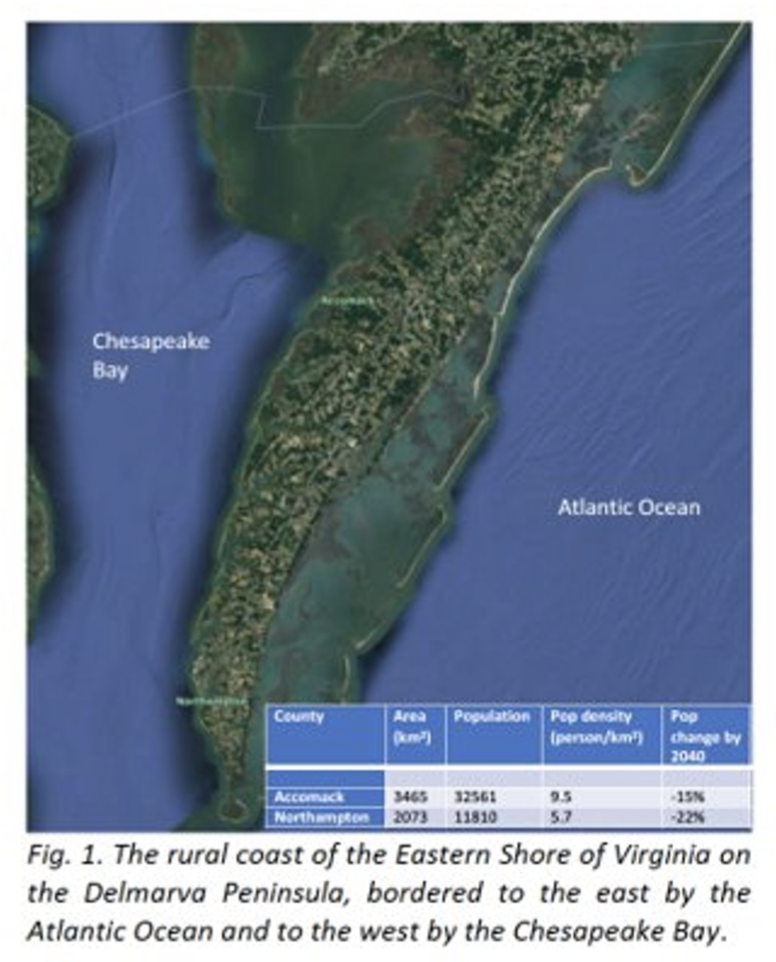

# **Overview**
This project is part of a collaboration with UVA’s Environmental Resilience Institute to study climate impacts on the rural Eastern Shore of Virginia (ESVA), with the goal of developing tools and building the capacity for communities to deal with these impacts. We will develop a synthetic population that represents these communities by combining information across multiple sources of data, administrative and survey data, to get a representation of these rural communities down to the level of individual households and farms. This will be used as an input into agent based models for stakeholder decisions, and hydrological models to measure flood hazard, water supply, and groundwater salinization.

# **Research Question**
How do coastal flooding and groundwater salinization impact crop production and coastal habitats?

Where are climate risks and inequities most pronounced now and in the future?

How will water security change across different communities? How does this change under different adaptation policies?

# **Goals**
####*Broader*
-Develop tools and building the capacity for communities to deal with the impacts of climate risk such as saltwater intrusion, accelerated sea level rise, storm flooding

-Create an agent-based model to inform stakeholders' decisions

-Create hydrological models to measure flood hazards, water supply, and ground water salinization

####*Specifically*
-Create a synthetic Population using IPF (Iterative Proportional Fitting)

-Data discovery and cleaning down to the level of individual household/farm

-Apply methods for demographic projections to predict how these populations will change over the next decades

# **Methods**

####*Literature Review*
Established familiarity with and understanding of current research on climate risk and synthetic methods before carrying out a new investigation to find out what research has already been done and identify what is unknown within the project

####*Data Inventory*
Explored and assessed the usability, accuracy, and biases of possible national and state data sources to create sub-county level data sets to generate a synthetic population, demographic projections, and for the use of all collaborators thoughout the course of the project

####*Syntheic Population*
Through a technique called iterative proportional fitting, a synthetic population down the the household level was created for Accomack and Northampton county based on the American Community Survey Public Use Microdata Sample (ACS PUMS)

#**Sponsor**
National Science Foundation (NSF)

<!-- Here's how you make a list: -->

<!-- *Tips for making figures look good:* -->

<!-- - Make text sizes BIG -->
<!-- - Stick to the same colors -->
<!-- - Decide to add titles, captions, etc in the figures OR add on the website for all figures -->

